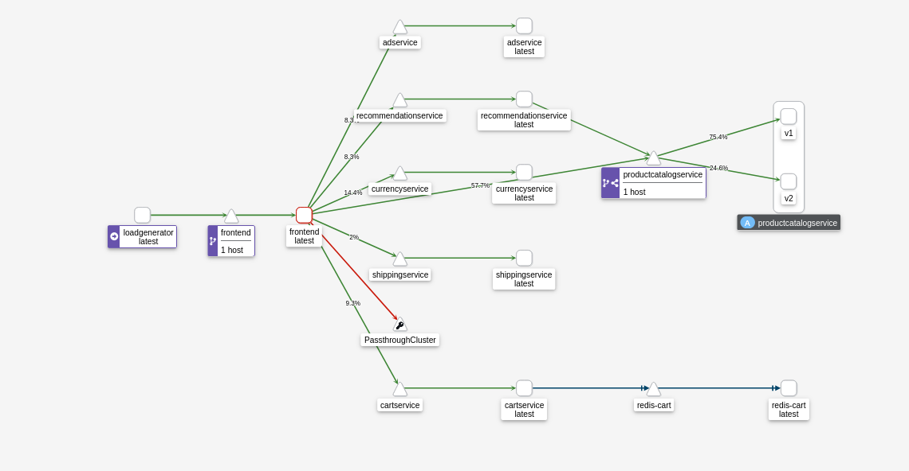

# Demo ~ Traffic Splitting

This repository demonstrates how to do a canary release with [Istio](https://istio.io/latest/). It also uses [Kiali](https://kiali.io/) to obsverse the traffic splitting.

## Dependencies

This demonstration uses the [microservices demo developped by Google LLC](https://github.com/GoogleCloudPlatform/microservices-demo).

To run this demonstration you need:
- [`kind`](https://kind.sigs.k8s.io/docs/user/quick-start/#installation)
- [`helm`](https://helm.sh/docs/intro/install/)

## Run the demo

### Bootstrap

To start the demo run `scripts/bootstrap.sh`. Once the script exits, run `watch kubectl get po -A` and wait for all the pods to have the status `Running`.
In your browser go to `kiali.vcap.me` and anf go to the `Graph` section. Clik on the `Display` dropdown and enable `Traffic Rate`.

### Canary release

To launch the caranry release run `scripts/canary-release.sh`. Check for the deployment of a `productcatalogservice-v2` pod to start. 
In the Kiali web page, click on the traingle `productcvatalogservice`. You should see to squares behind it, respectively annotated with `v1` and `v2`. The percentages on each link reprents the percentage of traffic being routed to each version.

## LICENSE

© 2022 [Padok](https://www.padok.fr/).

Licensed under the [Apache License](https://www.apache.org/licenses/LICENSE-2.0), Version 2.0 ([LICENSE](./LICENSE))
